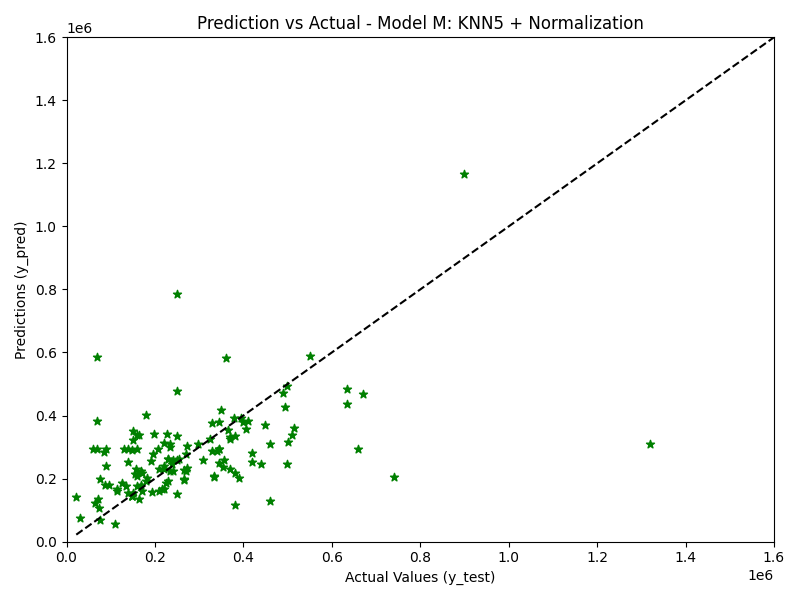
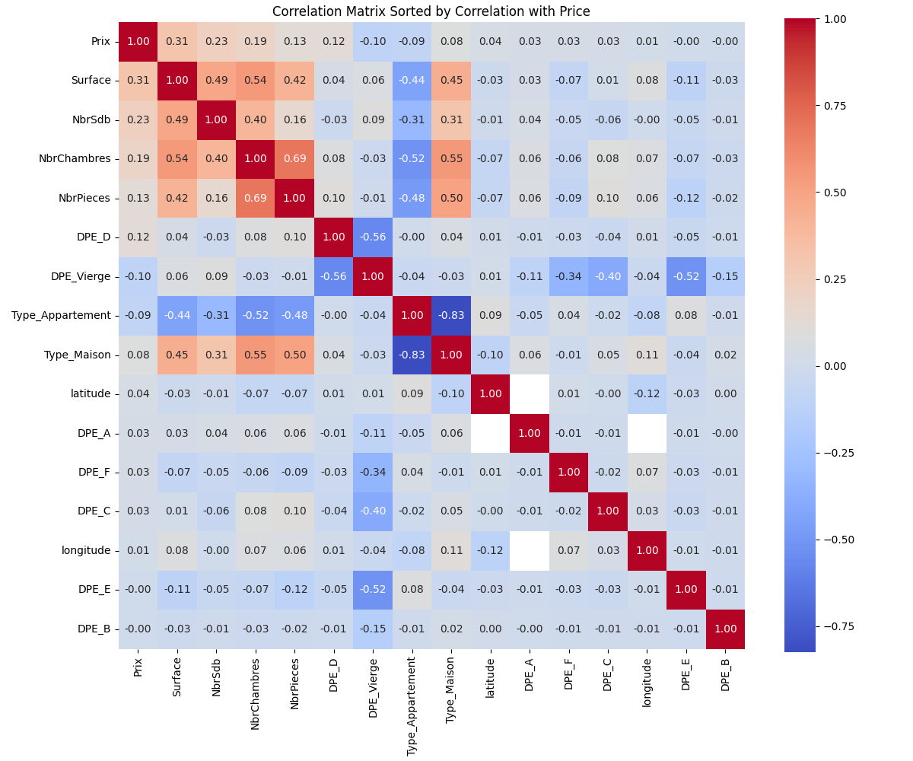

# 🏠 Prédiction des Prix Immobiliers par Web Scraping et Machine Learning

*Figure 1 – Prix Prédits vs Prix Réels avec le Modèle M (KNN + Normalisation)*

*Figure 2 – Matrice de Corrélation Triée par Corrélation avec le Prix*

---

## Vue d'ensemble du Projet

Ce projet vise à prédire les prix de l'immobilier en Île-de-France à partir de données collectées sur le site **immo-entre-particuliers.com**. Le projet se décompose en trois parties : web scraping, nettoyage des données et modélisation par apprentissage automatique.

---

## Partie 1 – Web Scraping

Nous avons extrait les données des annonces immobilières en utilisant `requests` et `BeautifulSoup`. Les informations collectées incluent :

- **Ville**
- **Type** (Maison ou Appartement)
- **Surface**
- **Nombre de pièces, chambres et salles de bain**
- **DPE** (Diagnostic de Performance Énergétique)
- **Prix** (uniquement les annonces supérieures à 10 000 €)

Les données brutes sont sauvegardées dans : `annonces_idf.csv`

---

## Partie 2 – Nettoyage et Préparation des Données

Le processus de nettoyage comprend :

1. **Inspection des données** – vérification de la conformité
2. **Traitement des valeurs manquantes** :
   - Les valeurs DPE manquantes (`-`) sont remplacées par `"Vierge"`
   - Les valeurs numériques manquantes sont remplacées par la moyenne de la colonne
3. **Création de variables indicatrices** :
   - Encodage one-hot pour le DPE et le type de bien
4. **Enrichissement géographique** :
   - Ajout de la latitude et longitude via le fichier `cities.csv`
5. **Normalisation des noms de villes** pour faciliter la jointure

Les données nettoyées sont sauvegardées dans : `annonces_nettoyees.csv`

---

## Partie 3 – Modélisation et Évaluation

Plusieurs modèles de régression ont été testés pour prédire les prix immobiliers :

- **Régression Linéaire (RL)**
- **Arbre de Décision** avec profondeur maximale de 4
- **K Plus Proches Voisins (KNN)** avec k=4 et k=5
- Prétraitements : Normalisation (`MinMaxScaler`) et Standardisation (`StandardScaler`)

### Modèle M : K Plus Proches Voisins (KNN)

- **Modèle final** : `KNeighborsRegressor(n_neighbors=5)` avec normalisation
- **Caractéristiques** : Toutes les variables numériques et encodées
- **Score R²** : 
  - Avec toutes les variables : 0.0471
  - Avec les 5 meilleures variables : **0.1584** 

### Analyses Complémentaires :
- Réduction de dimensionnalité avec PCA (2 composantes) → Score R² : -0.03
- Sélection des 5 variables les plus corrélées au prix → **Meilleure approche**

---

## 📈 Résultats Principaux

- La sélection des 5 variables les plus corrélées améliore significativement les performances
- La PCA avec 2 composantes dégrade les prédictions
- L'analyse de corrélation révèle les variables les plus importantes pour prédire le prix
- Les scores R² restent modestes, suggérant que le jeu de données pourrait être enrichi avec davantage de caractéristiques

---

## Technologies Utilisées

- **Python 3.x**
- **pandas** – manipulation de données
- **scikit-learn** – modèles d'apprentissage automatique
- **BeautifulSoup** – web scraping
- **matplotlib** – visualisations